> 🌎 Opções de Idioma:
>
> -  [Português Brasileiro](#) (atual)
> -  [English](./docs/en/README.md)

## Tabela de Conteúdos

-  [Visão Geral](#visão-geral)
-  [Objetivo do Projeto](#objetivo-do-projeto)
-  [Características Principais](#características-principais)
   -  [Resgate e Aquisição de UCS](#resgate-e-aquisição-de-ucs)
   -  [Informações Educativas](#informações-educativas)
   -  [Parceria Estratégica](#parceria-estratégica)
   -  [Iniciativas do Banco da Amazônia](#iniciativas-do-banco-da-amazônia)
-  [Contexto da COP29](#contexto-da-cop29)
-  [Benefícios para os Usuários](#benefícios-para-os-usuários)
-  [Navegação e Acessibilidade](#navegação-e-acessibilidade)
-  [Conclusão](#conclusão)
-  [Fluxo de Transferência UCS](#fluxo-de-transferência-ucs)

## Visão Geral

O projeto apresentado é uma **landing page** desenvolvida a pedido da **BMV (Bolsa de Moeda Verde)**, disponível em [bmv.global](https://www.bmv.global/), para o **Banco da Amazônia**, cujo site é [bancoamazonia.com.br](https://www.bancoamazonia.com.br/). Esta página foi criada especialmente para o evento **COP29**, a 29ª Conferência das Partes da Convenção-Quadro das Nações Unidas sobre Mudança Climática, realizada em Baku, Azerbaijão.

## Objetivo do Projeto

A landing page tem como principal objetivo promover a **sustentabilidade** e incentivar a **preservação da Amazônia** por meio da aquisição de **Unidades de Crédito de Sustentabilidade (UCS)**. Esta iniciativa busca transformar ações sustentáveis em valor real, oferecendo oportunidades para que indivíduos e organizações contribuam ativamente para a conservação ambiental e o desenvolvimento socioeconômico da região amazônica.

## Características Principais

### Resgate e Aquisição de UCS

-  A página permite que os participantes da COP29 resgatem sua UCS exclusiva, recebida como parte do evento.
-  Incentiva a aquisição de unidades adicionais, destacando o impacto tangível de cada UCS na preservação ambiental.

### Informações Educativas

-  **Por que adquirir mais UCS?**: Explicações sobre como cada UCS representa uma ação concreta de preservação.
-  **Transformando através da sustentabilidade**: Detalhamento dos benefícios ecológicos e sociais.
-  **O que nos guia**: Apresentação da missão, visão e valores do projeto.

### Parceria Estratégica

-  **BMV (Bolsa de Moeda Verde)**: Uma Greentech que traz estímulo e viabilidade econômica para a conservação da biodiversidade.
-  **Banco da Amazônia**: Instituição financeira comprometida com o desenvolvimento sustentável da Amazônia.

### Iniciativas do Banco da Amazônia

O **Banco da Amazônia** é uma instituição financeira dedicada ao desenvolvimento sustentável da região amazônica, promovendo crédito verde e impulsionando a agricultura familiar. Sua missão é oferecer soluções financeiras inovadoras que preservem a biodiversidade e incentivem o uso responsável dos recursos naturais, pautando-se em ética, transparência e inovação.

A instituição destaca-se por seu forte compromisso socioambiental, apoiando projetos sustentáveis e transformando ativos ecológicos em benefícios econômicos. Foi reconhecida pelo selo Tesouro Verde por três anos consecutivos, integrando conservação ambiental com a criação de oportunidades financeiras. Além disso, alinha-se à proposta inovadora da moeda UCS (Unidade de Crédito Sustentável).

As iniciativas do banco incluem:

-  **Preservação da Natureza**: Proteção de **1.757 m²** de floresta, conservação de espécies de flora e fauna, e prevenção de **250 toneladas de CO₂** por meio da manutenção de reservatórios de carbono.
-  **Recursos Hídricos**: Preservação de **5.772 litros de água** por hectare anualmente, recuperação de nascentes e melhoria da qualidade da água local.
-  **Biodiversidade**: Estabelecimento de corredores ecológicos, proteção de **13.229 espécies** e aumento das populações de polinizadores.
-  **Impacto Social**: Criação de empregos sustentáveis, benefício direto a **250 famílias** e implementação de projetos de educação ambiental.
-  **Desenvolvimento Comunitário**: Apoio a cooperativas locais e aumento da renda média das comunidades envolvidas.
-  **Agricultura Sustentável**: Conversão de **878 m²** para práticas agrícolas sustentáveis, redução no uso de pesticidas e reintrodução de cultivos nativos.

O Banco da Amazônia busca ser o principal banco de desenvolvimento na região, inovador, com colaboradores e resultados sólidos, guiado por sua missão de desenvolver uma Amazônia sustentável com crédito e soluções eficazes.

## Contexto da COP29

A **COP29** é um evento global que reúne líderes mundiais, organizações e especialistas para discutir e implementar ações contra as mudanças climáticas. A realização da conferência em Baku, Azerbaijão, proporciona uma plataforma internacional para a apresentação de iniciativas inovadoras em sustentabilidade.

## Benefícios para os Usuários

-  **Impacto Tangível**: Contribuição real para a preservação ambiental.
-  **Reconhecimento**: Recebimento de certificados personalizados.
-  **Engajamento Comunitário**: Participação em uma rede global de defensores do meio ambiente.
-  **Informação e Educação**: Acesso a conteúdo educativo sobre conservação e sustentabilidade.

## Navegação e Acessibilidade

-  **Design Intuitivo**: Experiência de usuário fluida e intuitiva.
-  **Disponibilidade Multilíngue**: Conteúdo disponível em diversos idiomas para alcançar um público global.
-  **Compatibilidade**: Acessível em múltiplos dispositivos, permitindo interação a partir de qualquer lugar.

## Conclusão

Este projeto representa a união de esforços entre a **BMV** e o **Banco da Amazônia** para promover a sustentabilidade durante a **COP29**. A landing page serve como um portal de engajamento, educação e ação, incentivando participantes a se envolverem ativamente na conservação da Amazônia. Ao adquirir e resgatar **Unidades de Crédito de Sustentabilidade**, os usuários não apenas contribuem para a proteção ambiental, mas também fortalecem o desenvolvimento sustentável e socioeconômico da região.

## Fluxo de Transferência UCS

```mermaid
flowchart TD
    subgraph "Evento"
        A[Moeda com QR Code] --> |Scan QR| B[Landing Page]
    end

    subgraph "Formulário de Resgate"
        B --> C[Formulário de Registro]
        C --> D["Nome"]
        C --> E["E-mail"]
        C --> F["Código UCS"]

        C --> G{Endereço da Wallet}
        G --> |Inserir Manualmente| H[Input Wallet Address]
        G --> |Gerar Nova| I[Web3 Auth with Google]
        I --> J[Gerar Wallet]

        H --> K[Wallet Address Validado]
        J --> K
    end

    subgraph "Validação e Processamento"
        K --> L[Submissão do Formulário]
        L --> M{Validação dos Dados}
        M --> |Inválido| N[Mensagem de Erro]
        N --> |Nova Tentativa| C
        M --> |Válido| O[Requisição API]
    end

    subgraph "Finalização"
        O --> P{Verificação do Token}
        P --> |Já Utilizado| Q[Acesso Negado]
        P --> |Disponível| R[Transferência UCS]
        R --> S[Bloqueio do Token]
        R --> T[Mensagem de Sucesso]
    end

    classDef evento fill:#fff,stroke:#333,color:#333,stroke-width:2px
    classDef form fill:#4065a9,color:#fff
    classDef validacao fill:#ff9900,color:#000
    classDef final fill:#70468c,color:#fff
    classDef error fill:#d32f2f,color:#fff
    classDef success fill:#388e3c,color:#fff
    classDef wallet fill:#2196f3,color:#fff

    class A,B evento
    class C,D,E,F form
    class G,H,I,J,K wallet
    class L,M,O validacao
    class P,R,S final
    class N,Q error
    class T success
```

