> 🌎 Opções de Idioma:
>
> -  [Português Brasileiro](#) (atual)
> -  [English](./docs/en/README.md)

## Tabela de Conteúdos

-  [Visão Geral](#visão-geral)
-  [Objetivo do Projeto](#objetivo-do-projeto)
-  [Características Principais](#características-principais)
   -  [Resgate e Aquisição de UCS](#resgate-e-aquisição-de-ucs)
   -  [Informações Educativas](#informações-educativas)
-  [Contexto da COP29](#contexto-da-cop29)
-  [Fluxo de Transferência UCS](#fluxo-de-transferência-ucs)

## Visão Geral

O projeto apresentado é uma **landing page** desenvolvida a pedido da **BMV**, disponível em [bmv.global](https://www.bmv.global/), para o **Banco da Amazônia**, cujo site é [bancoamazonia.com.br](https://www.bancoamazonia.com.br/). Esta página foi criada especialmente para o evento **COP29**, a 29ª Conferência das Partes da Convenção-Quadro das Nações Unidas sobre Mudança Climática, realizada em Baku, Azerbaijão.

## Objetivo do Projeto

A landing page tem como principal objetivo promover a **sustentabilidade** e incentivar a **preservação da Amazônia** por meio da aquisição de **Unidades de Crédito de Sustentabilidade (UCS)**. Esta iniciativa busca transformar ações sustentáveis em valor real, oferecendo oportunidades para que indivíduos e organizações contribuam ativamente para a conservação ambiental e o desenvolvimento socioeconômico da região amazônica.

## Características Principais

### Resgate e Aquisição de UCS

-  A página permite que os participantes da COP29 escaneiem a "Moeda" recebida no evento, que possui um QR Code. Este código redireciona para a página e contém um número de série exclusivo para resgatar sua UCS.

-  Incentiva a aquisição de unidades adicionais, destacando o impacto tangível de cada UCS na preservação ambiental.

### Informações Educativas

-  **Por que adquirir mais UCS?**: Explicações sobre como cada UCS representa uma ação concreta de preservação.
-  **Transformando através da sustentabilidade**: Detalhamento dos benefícios ecológicos e sociais.
-  **O que nos guia**: Apresentação da missão, visão e valores do Banco da Amazônia.

## Contexto da COP29

A **COP29** é um evento global que reúne líderes mundiais, organizações e especialistas para discutir e implementar ações contra as mudanças climáticas. A realização da conferência em Baku, Azerbaijão, proporciona uma plataforma internacional para a apresentação de iniciativas inovadoras em sustentabilidade.

## Fluxo de Transferência UCS

```mermaid
flowchart TD
    subgraph "Evento"
        A[Moeda com QR Code] --> |Scan QR| B[Landing Page]
    end

    subgraph "Formulário de Resgate"
        B --> C[Formulário de Registro]
        C --> D["Nome"]
        C --> E["E-mail"]
        C --> F["Código UCS"]

        C --> G{Endereço da Wallet}
        G --> |Inserir Manualmente| H[Input Wallet Address]
        G --> |Gerar Nova| I[Web3 Auth with Google]
        I --> J[Gerar Wallet]

        H --> K[Wallet Address Validado]
        J --> K
    end

    subgraph "Validação e Processamento"
        K --> L[Submissão do Formulário]
        L --> M{Validação dos Dados}
        M --> |Inválido| N[Mensagem de Erro]
        N --> |Nova Tentativa| C
        M --> |Válido| O[Requisição API]
    end

    subgraph "Finalização"
        O --> P{Verificação do Token}
        P --> |Já Utilizado| Q[Acesso Negado]
        P --> |Disponível| R[Transferência UCS]
        R --> S[Bloqueio do Token]
        R --> T[Mensagem de Sucesso]
    end

    classDef evento fill:#fff,stroke:#333,color:#333,stroke-width:2px
    classDef form fill:#4065a9,color:#fff
    classDef validacao fill:#ff9900,color:#000
    classDef final fill:#70468c,color:#fff
    classDef error fill:#d32f2f,color:#fff
    classDef success fill:#388e3c,color:#fff
    classDef wallet fill:#2196f3,color:#fff

    class A,B evento
    class C,D,E,F form
    class G,H,I,J,K wallet
    class L,M,O validacao
    class P,R,S final
    class N,Q error
    class T success
```

